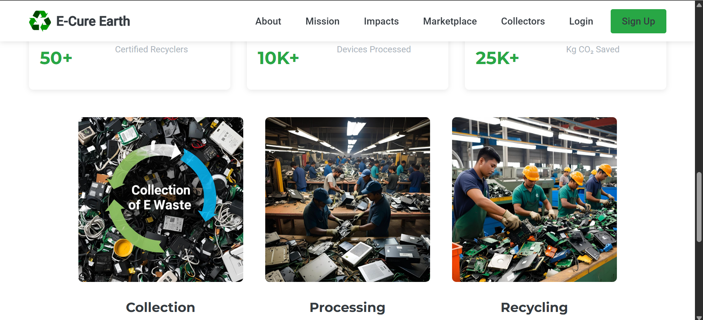
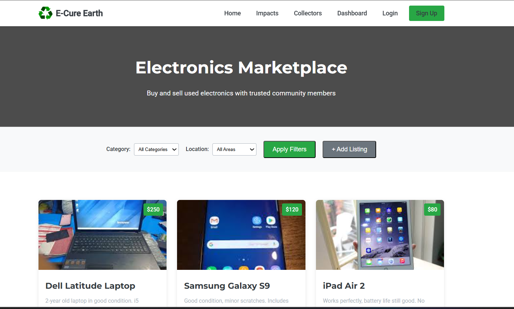
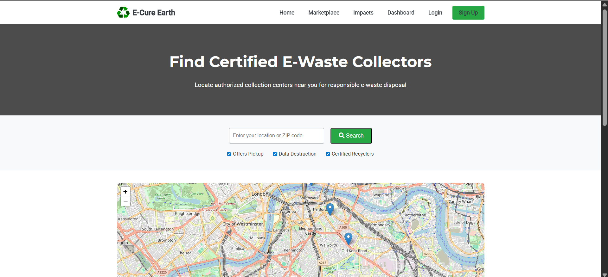

# 🌍 E-Cure Earth — E-Waste Management (Frontend)

A responsive website for **e-waste awareness and sustainable disposal**.  
It includes awareness pages, a marketplace, and a dashboard for better e-waste management.

## ✨ Features
- Awareness section (why and how to recycle)
- Marketplace for e-waste items
- Collector & dashboard pages
- Responsive design (works on desktop + mobile)

## 🛠 Tech Stack
- HTML  
- CSS  
- JavaScript  

## 🚀 Live Demo
👉 [View Website](https://Yash-Choubey09.github.io/e-waste-frontend/)

## 📷 Screenshots
## 📷 Screenshots






## 📌 How to Run Locally
1. Clone this repo:
   ```bash
   git clone https://github.com/Yash-Choubey09/e-waste-frontend.git
